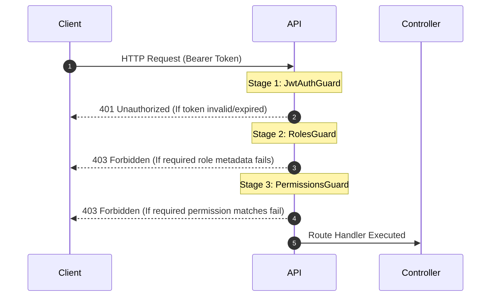
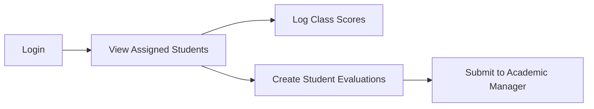
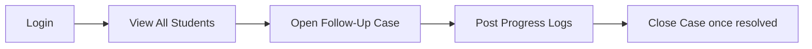

# 🔐 Role-Based Access Control (RBAC) Specification

This document details the roles, permissions, and security guards implemented in the Student Follow-Up System (SPTS). 

---

## 🏛️ Authentication & Guard Architecture

Every request to a protected API endpoint undergoes a three-stage middleware validation sequence defined in [app.module.ts](file:///C:/Users/slethean/Documents/PNC/PNC/PNC-SPTS-API/src/app.module.ts):

1. **`JwtAuthGuard`**: Validates the JWT in the `Authorization` header, handles expiration/revocation, and attaches the payload to `request.user`.
2. **`RolesGuard`**: Checks if the request handler requires specific roles via the `@Roles()` decorator. `SUPER_ADMIN` and `ADMIN` bypass this guard automatically.
3. **`PermissionsGuard`**: Evaluates active user permissions loaded from database mappings via the `@Permissions()` decorator. Supports wildcard matches (e.g. `student.*` matches `student.read`).

---

## 👥 System Roles & Mapped Permissions

Below is the list of active roles configured on the staging API and seeded via [seed.ts](file:///C:/Users/slethean/Documents/PNC/PNC/PNC-SPTS-API/src/prisma/seed.ts):

### 1. `SUPER_ADMIN`
The root administrator with complete platform control.
* **Permissions**:
  * `user.create`, `user.read`, `user.update`, `user.delete`, `user.assign_role`
  * `role.create`, `role.read`, `role.update`, `role.delete`
  * `permission.read`, `permission.assign`
  * `system.manage`
  * `audit.read`

### 2. `ADMIN`
General system administrator managing daily operations.
* **Permissions**:
  * `user.create`, `user.read`, `user.update`, `user.assign_role`
  * `student.*` (Full student management capabilities)
  * `followup.*` (Full case opening/managing capabilities)
  * `evaluation.*` (Full evaluation capabilities)
  * `report.read`

### 3. `ACADEMIC_MANAGER`
Managers responsible for coordinating curriculum standards, evaluations, and case escalations.
* **Permissions**:
  * `student.read`, `student.update`
  * `followup.read`, `followup.approve`
  * `evaluation.read`, `evaluation.approve`
  * `report.read`

### 4. `FOLLOWUP_OFFICER`
Specialized monitoring officers responsible for managing student follow-up lifecycles.
* **Permissions**:
  * `student.read`, `student.update`
  * `followup.create`, `followup.update`, `followup.close`

### 5. `TUTOR` (Default role for Teachers)
Classroom teachers and academic instructors.
* **Permissions**:
  * `student.read_assigned` (Access restricted to their own class students)
  * `evaluation.create`, `evaluation.update`, `evaluation.submit`
  * `score.create`, `score.update`

### 6. `STUDENT`
Students accessing their own progress reports.
* **Permissions**:
  * `profile.read`
  * `followup.read_own`
  * `evaluation.read_own`
  * `score.read_own`

---

## ⚡ Key Workflows

### Standard Teacher (Tutor) workflow:

### Follow-Up Officer workflow:

---

## 🖥️ Page-by-Page Route Permissions Mapping

Here is the mapping of frontend routes to user roles and backend permissions:

| Route Path | View / Component | Admin / Super Admin | Academic Manager | Follow-Up Officer | Teacher / Tutor | Required Permission |
| :--- | :--- | :---: | :---: | :---: | :---: | :--- |
| **Login** (`/`) | `LoginView.vue` | **YES** | **YES** | **YES** | **YES** | None (Public) |
| **Dashboard** (`/admin`) | `DashboardView.vue` | **YES** | **YES** | **YES** | **YES** | `profile.read` |
| **Student List** (`/admin/students`) | `StudentListView.vue` | **YES** | **YES** | **YES** | **YES** | `student.read`/`student.read_assigned` |
| **Student Profile** (`/admin/students/:id`) | `StudentDetailsView.vue` | **YES** | **YES** | **YES** | **YES** | `student.read`/`student.read_assigned` |
| **My Profile** (`/admin/profile`) | `ProfileView.vue` | **YES** | **YES** | **YES** | **YES** | `profile.read` |
| **Active Follow-Ups** (`/admin/active`) | `ActiveFollowUpsView.vue` | **YES** | **YES** | **YES** | **NO** | `followup.read` |
| **Follow-Up Timeline** (`/admin/tasks`) | `FollowUpTimelineView.vue` | **YES** | **YES** | **YES** | **NO** | `followup.read` |
| **User Management** (`/admin/users`) | `UserManagementView.vue` | **YES** | **NO** | **NO** | **NO** | `user.read` |
| **Teacher Management** (`/admin/teachers`) | `TeacherManagementView.vue` | **YES** | **NO** | **NO** | **NO** | `teacher.read` |
| **Follow-Up Types** (`/admin/settings`) | `FollowUpTypesView.vue` | **YES** | **NO** | **NO** | **NO** | `system.manage` |
| **Kanban Board** (`/board`) | `StudentBoard.vue` | **YES** | **NO** | **NO** | **NO** | None (Mockup only) |

---

### 🎨 Sidebar Cleanliness & Layout Rules per Role

* **Admin / Super Admin**: 
  * Full visibility of all groups: *Menu, Productivity, Administration, and Configuration*.
  * Has access to `/board` (mockup dashboard) if needed.
* **Academic Manager / Follow-Up Officer**:
  * Sees *Menu* and *Productivity* groups.
  * Sees only **Active Follow-Ups** under *Administration* (hides User & Teacher Management).
  * Hides *Configuration* entirely.
* **Teacher / Tutor**:
  * Sees **only** the *Menu* group containing **Dashboard** and **Student List** (plus their own **Profile** in the account settings menu).
  * *Productivity, Administration, and Configuration* groups are completely hidden to keep the view clean.
  * Direct URL access to hidden paths redirects back to `/admin`.
